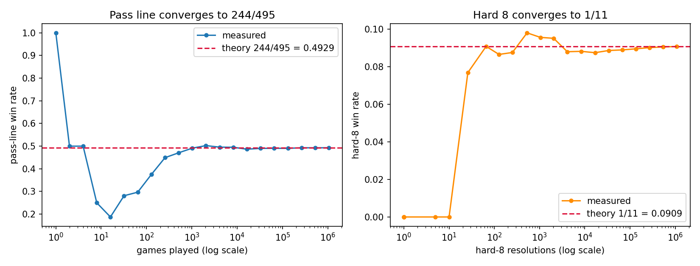
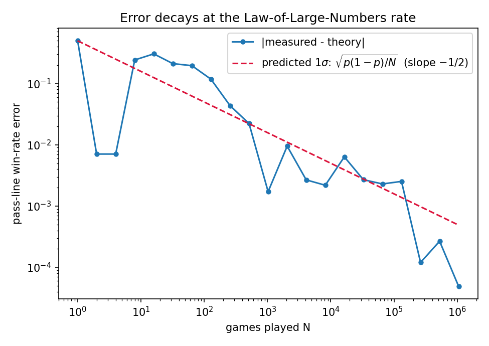
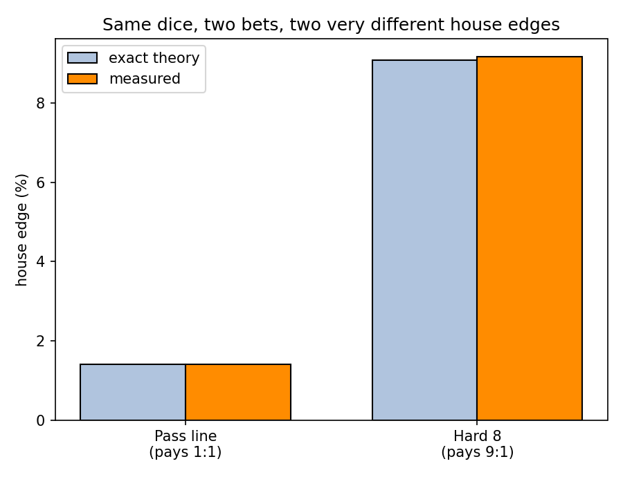

<div align="center">

# 🎲 The Craps Machine
### Measuring House Edge in Silicon

**ECE 316 Digital Logic Design × ECE 351K Probability — Winners Dinner 3**

Kanishk Sama · Krithik Sama · Aditya Patra · Sean Nievera

</div>

---

## What this is

A Verilog machine that plays the casino game of **craps** — the pass-line bet plus a hard-8 side bet — over a million times, and checks whether its measured win rates converge to the values probability theory predicts *before* the machine is ever run.

The same design does two things:
- **In simulation** it plays 1,048,576 games and writes the results to a CSV, which a Python script turns into the convergence and house-edge plots.
- **On a Basys3 FPGA** it plays 10,000 games per button press and shows the result live on the 7-segment display, or lets you play craps by hand one roll at a time.

| Bet | Theory says P(win) | House edge |
|:--|:--:|:--:|
| Pass line | 244/495 ≈ **0.4929** | 1.41% |
| Hard 8 (pays 9:1) | 1/11 ≈ **0.0909** | 9.09% |

---

## 📁 Project layout

```
design/                  the hardware (synthesizable Verilog)
├── lfsr.v               maximal-length LFSR (parameterized taps)
├── die_gen.v           one die: rejection sampling + valid handshake
├── passline_fsm.v      pass-line game FSM (2 states + point register)
├── hardways_fsm.v      hard-8 side-bet watcher (always armed)
├── craps_core.v        top of the core: dice → decode → both FSMs
└── board/              FPGA-only I/O wrapper
    ├── top.v           board top level: stats mode + play mode
    ├── debounce.v      button synchronizer / debouncer
    ├── bin2bcd.v       binary → BCD (double-dabble)
    └── sevenseg_display.v   4-digit multiplexed display driver

tb/                      testbenches (simulation only, not synthesized)
├── tb_craps.v          runs 2²⁰ games, writes results.csv
└── tb_board.v          verifies both board modes before hardware

constraints/
└── basys3.xdc          Basys3 pin assignments

analysis/
└── plot_results.py     turns results.csv into the three plots

output/                  generated results (CSV + PNGs land here)
README.md                this file
```

> **Design vs. testbench:** everything in `design/` becomes real hardware. Everything in `tb/` exists only to exercise it in simulation — the `$fopen`/`$fdisplay` file writes could never run on a chip.

---

## ▶️ Part 1 — Running the simulation (the graded result)

This produces the win-rate data and plots.

### Step 1 · Simulate in Vivado
1. Add every file in `design/` **and** `design/board/` as *design sources*, and `tb/tb_craps.v` as a *simulation source*.
2. Set `tb_craps` as the simulation top: right-click it → **Set as Top**.
3. **Run Behavioral Simulation.** The default runtime (1000 ns) is far too short — in the **Tcl Console**, type:
   ```
   run -all
   ```
4. Wait ~2 minutes. When it finishes, the console prints a summary and writes `results.csv`.

### Step 2 · Find the CSV
In the Tcl Console, type `pwd` to see where the simulator ran. The file is at:
```
<project>/<project>.sim/sim_1/behav/xsim/results.csv
```

### Step 3 · Make the plots
Copy `analysis/plot_results.py` next to `results.csv`, then from a normal terminal:
```
pip install pandas matplotlib
python plot_results.py
```
This writes three PNGs and prints a measured-vs-theory table.

> **No Python on the lab machine?** The handout's fallback works: double-click `results.csv` to open it in Excel and chart the columns there.

### What you should see
The run is deterministic, so these numbers are exact every time:

| Quantity | Measured | Theory | Gap |
|:--|:--:|:--:|:--:|
| Pass-line win rate | 0.492978 | 0.492929 | 0.10 σ |
| Hard-8 win rate | 0.090832 | 0.090909 | 0.28 σ |
| Rolls per game | 3.3714 | 3.3758 | — |

And the three plots the script generates:

**Both win rates converge onto their theoretical values**


**The error shrinks at exactly the Law-of-Large-Numbers rate (slope −½ on log–log axes)**


**Measured house edge matches theory for both bets**


> These images were produced by the run described above. If they don't display, check that the PNGs are in `output/` and that the paths match your folder names.

---

## 🎛️ Part 2 — The board demo (Basys3)

The same core, synthesized to hardware, with two modes.

### Build & program
1. Add `design/` + `design/board/` as design sources and set **`top`** as the top module.
2. Add `constraints/basys3.xdc`.
3. Confirm the part is **xc7a35tcpg236-1**.
4. **Generate Bitstream** (runs synthesis + implementation first), then **Open Hardware Manager → Program Device**.

> Before building, run `tb/tb_board.v` in simulation — it verifies both modes with shrunk timing parameters so you catch logic bugs on your PC, not on the board.

### Controls

| Control | Does |
|:--|:--|
| **BTNU** | Reset (also restarts the dice sequence) |
| **BTNC** | Action: run a batch (stats) / roll once (play) |
| **SW0** | Mode: **down = stats**, **up = play** |

### Stats mode (SW0 down)
Each press plays **10,000 fresh games** in ~0.6 ms and shows the **win count** — which equals the win rate × 10⁴, so the display reads **≈ 4929**. Because the design is deterministic, the first press after reset always shows exactly **4934**; repeated presses scatter within about ±100 (that scatter *is* the sampling distribution, shown live).

### Play mode (SW0 up)
Each press rolls once. The display shows `[die1][die2][sum]`, and the LEDs walk the game: LED0 = come-out phase, LED1 = point phase, LED5:2 = current point (binary), LED6 = last game won, LED7 = last game lost.

> A full operator's guide — every LED, every quirk, and what to say for each — is in **`BOARD_MANUAL.md`**.

---

## 🧠 How it works, in one paragraph

Two LFSRs (with **different feedback polynomials**, so they aren't just time-shifted copies of each other) each feed a **rejection sampler** that turns 3 random bits into a fair 1–6 die — rejecting the values 6 and 7 so every face is exactly 1/6 rather than biased. When both dice report `valid`, one roll is decoded into a sum and a "pair" flag, and that single roll is watched by two state machines at once: the **pass-line FSM** (come-out ⇄ point) and the **hard-8 watcher**. Running counters tally wins, games, and rolls; the testbench snapshots them at powers of two to keep file writes small and the log-log plot evenly spaced.

---

## ✅ Submission contents

Verilog sources (`design/`), testbenches (`tb/`), `results.csv`, and the plots — **no** build artifacts (`.bit`, `.jou`, logs, or the `.sim` project directory).
